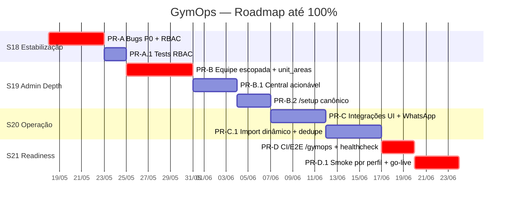
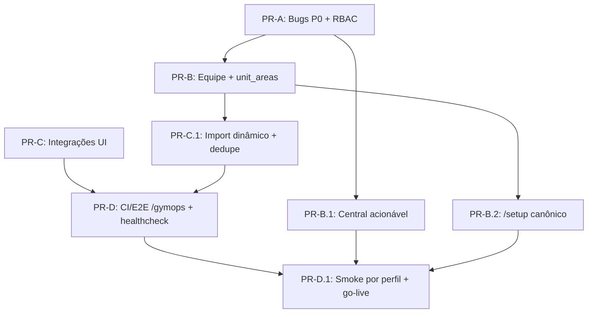

# GymOps — Plano de Implementação até Produto 100%

**Última atualização**: 2026-05-17  
**Baseado em**: [`docs/backlog.md`](backlog.md) + [`docs/status.md`](status.md).  
**Estratégia**: 4 sprints lineares (S18 → S21) com ordem de PRs determinística.

> A ordem **importa**. Tente paralelizar dentro de uma sprint, mas **não pule sprints**. Bugs P0 de RBAC/contexto (S18) bloqueiam a UI escopada da equipe (S19). UI da equipe escopada bloqueia bootstrap canônico (S19). Bootstrap canônico bloqueia smoke por perfil (S21).

---

## Visão geral

---

## Sprint 18 — Estabilização crítica (7–10 dias)

**Objetivo**: zerar bugs P0 que invalidam fluxos básicos e travam discurso de "100%".

### PR-A — Bugs P0 + RBAC consistente

**Arquivos principais**:
- [`apps/web/src/app/(app)/activities/page.tsx`](../apps/web/src/app/(app)/activities/page.tsx)
- [`apps/api/src/routes/activities/index.ts`](../apps/api/src/routes/activities/index.ts) (apenas para validar contratos)
- [`apps/web/src/app/setup/page.tsx`](../apps/web/src/app/setup/page.tsx)
- [`apps/api/src/routes/auth/index.ts`](../apps/api/src/routes/auth/index.ts)
- [`apps/api/src/lib/rbac.ts`](../apps/api/src/lib/rbac.ts)
- [`apps/web/src/store/auth.ts`](../apps/web/src/store/auth.ts)

**Itens incluídos**: BUG-001, BUG-002, BUG-003, BUG-004, BUG-005, BUG-006, BUG-007.

**Ordem dentro do PR**:
1. **BUG-001 / 002 / 003** (atividades — independentes, podem rodar em paralelo). Frontend-only.
2. **BUG-004** (`/setup` senha mínima 8). Frontend-only.
3. **BUG-005** (login contexto por área). Backend. **Cria** helper canônico `resolveUserContext(userId, organizationId)` em `apps/api/src/lib/auth-context.ts` consumido por `/auth/login`, `/auth/refresh`, `/auth/consume` e `/me/role`.
4. **BUG-007** (`hasUnitRole()` cobre área). Backend. Reutiliza helper canônico.
5. **BUG-006** (`canCreate()` frontend alinhado). Depende de [`docs/rbac-matrix.md`](rbac-matrix.md) atualizada como fonte da verdade.

**Critério de aceite do PR**:
- `pnpm --filter @gymops/api typecheck && pnpm --filter @gymops/web typecheck` limpos.
- `pnpm --filter @gymops/api test` passa com os novos testes:
  - `auth.login-by-area.test.ts`
  - `rbac.has-unit-role.test.ts`
- E2E smoke da Central de Atividades passa filtro por prioridade + bulk update + export.
- Atualizar [`docs/backlog.md`](backlog.md) marcando BUG-001..007 como ✅.

---

## Sprint 19 — Profundidade administrativa (10–14 dias)

**Objetivo**: dar autonomia real ao admin — equipe escopada, unit_areas, central acionável, organização completa, /setup operacional.

### PR-B — Equipe escopada + `unit_areas` UI

**Arquivos principais**:
- [`apps/web/src/app/(app)/settings/team/page.tsx`](../apps/web/src/app/(app)/settings/team/page.tsx)
- [`apps/web/src/app/(app)/settings/units/page.tsx`](../apps/web/src/app/(app)/settings/units/page.tsx) (aba "Áreas")
- [`apps/web/src/lib/admin-api.ts`](../apps/web/src/lib/admin-api.ts) (extensões)
- [`apps/api/src/routes/memberships/index.ts`](../apps/api/src/routes/memberships/index.ts) (se precisar de PATCH para editar role/scope)

**Itens incluídos**: FEAT-001, FEAT-002.

**Ordem dentro do PR**:
1. Estender `admin-api.ts`: `membershipsApi.update(id, { role?, scopeType?, scopeId? })`.
2. Backend: garantir que `PATCH /memberships/:id` aceita mudança de papel/escopo (criar se não existir).
3. **FEAT-001** — Equipe: refatorar `team/page.tsx` em 3 abas (Org / Por unidade / Por área); convite com seletor de escopo; edição inline; histórico de convites com filtro por status.
4. **FEAT-002** — Unidades: adicionar aba "Áreas da unidade" usando `unitsApi.addArea`/`removeArea`/`reorderAreas` (já existentes). Drag-and-drop simples (ou setas se complexo).

**Critério de aceite**:
- Owner convida usuário como `area_leader` de uma área específica via UI.
- Owner promove um `executor` org-level para `unit_manager` de uma unidade via UI.
- Admin vincula uma área a uma unidade e reordena.

### PR-B.1 — Central de Atividades acionável

**Arquivos**:
- [`apps/web/src/app/(app)/activities/page.tsx`](../apps/web/src/app/(app)/activities/page.tsx)
- [`apps/web/src/components/activities/ActivityDrawer.tsx`](../apps/web/src/components/activities/ActivityDrawer.tsx) (drill-down)
- [`apps/web/src/lib/admin-api.ts`](../apps/web/src/lib/admin-api.ts) (`savedViewsApi` já existe)

**Itens**: FEAT-003.

**Ordem**:
1. Paginação por cursor (consumir `meta.nextCursor`).
2. Filtro por responsável (autocomplete `/users?organizationId=...&q=`).
3. Drill-down: clicar na linha abre `ActivityDrawer` (componente reutilizado).
4. Saved views: dropdown no header, dialog de criar/salvar.
5. Bulk actions estendidos: prioridade, atribuir/desatribuir, arquivar.

### PR-B.2 — `/setup` canônico

**Arquivos**:
- [`apps/api/src/lib/bootstrap-organization.ts`](../apps/api/src/lib/bootstrap-organization.ts) (novo — função compartilhada)
- [`apps/api/src/routes/organizations/index.ts`](../apps/api/src/routes/organizations/index.ts) (consumir)
- [`packages/db/prisma/seed.ts`](../packages/db/prisma/seed.ts) (consumir)
- [`apps/web/src/app/setup/page.tsx`](../apps/web/src/app/setup/page.tsx) (UI 4 passos: org → owner → unidade opcional → confirmar)

**Itens**: FEAT-004.

**Critério**: [`docs/bootstrap-spec.md`](bootstrap-spec.md).

---

## Sprint 20 — Operação e integrações (8–12 dias)

**Objetivo**: dar diagnóstico operacional ao admin sem ler logs de servidor.

### PR-C — Integrações UI completa

**Arquivos**:
- [`apps/web/src/app/(app)/settings/integrations/page.tsx`](../apps/web/src/app/(app)/settings/integrations/page.tsx)
- [`apps/web/src/lib/admin-api.ts`](../apps/web/src/lib/admin-api.ts) (`integrationsExtApi` já existe)

**Itens**: FEAT-005.

**Ordem**:
1. Polling de health do Trello a cada 30s; badge `healthy/unhealthy`.
2. Botão "Reconectar" abre URL retornada por `/integrations/trello/reconnect`.
3. Listagem de boards conectados (`/integrations/trello/boards`).
4. Card WhatsApp: modo (sandbox/prod), número remetente, últimos 5 erros, botão "Testar canal" (envia template para o próprio usuário).

### PR-C.1 — Import dinâmico + dedupe cross-job

**Arquivos**:
- [`apps/web/src/app/(app)/settings/import/page.tsx`](../apps/web/src/app/(app)/settings/import/page.tsx)
- [`apps/api/src/imports/trello/processor.ts`](../apps/api/src/imports/trello/processor.ts)
- [`packages/db/prisma/schema.prisma`](../packages/db/prisma/schema.prisma) (nova coluna ou tabela `ImportSource`)

**Itens**: FEAT-006.

**Decisão de design**:
- **Opção preferida**: nova tabela `import_sources(organization_id, provider, external_id, activity_id, created_at)` com `@@unique([organizationId, provider, externalId])`.
- Em `commitImport`: antes de criar atividade, consultar `import_sources`. Se existir → marcar `ImportItem.status='skipped'` com `errorMessage='Duplicate of activity X'`.
- Migration aplicada via `docker exec gym-postgres-1 psql` (workaround documentado em [`CLAUDE.md`](../CLAUDE.md)).

**Frontend**:
- Wizard carrega áreas reais via `areasApi.list()`.
- Mapeamento de board → unidade vira `Select` de unidades existentes (com opção "Criar nova"); guarda `targetUnitId`.

---

## Sprint 21 — QA, docs e readiness (5–7 dias)

**Objetivo**: travar o produto real em `/gymops` na pipeline e validar smoke por perfil.

### PR-D — CI/E2E path-aware + healthchecks

**Arquivos**:
- [`.github/workflows/e2e.yml`](../.github/workflows/e2e.yml) — adicionar `pull_request`
- [`.github/workflows/ci.yml`](../.github/workflows/ci.yml) — job `build-gymops`
- [`docker-compose.public.yml`](../docker-compose.public.yml) — healthchecks web/gateway + `service_healthy`
- [`apps/web/Dockerfile`](../apps/web/Dockerfile) — instalar `wget` ou `curl` para healthcheck
- [`apps/api/src/app.ts`](../apps/api/src/app.ts) — CORS via `ALLOWED_ORIGINS`
- [`apps/api/src/env.ts`](../apps/api/src/env.ts) — adicionar `ALLOWED_ORIGINS`

**Itens**: OPS-001, OPS-002, BUG-009, BUG-010.

### PR-D.1 — Smoke por perfil + go-live

**Arquivos**:
- [`docs/qa-release-checklist.md`](qa-release-checklist.md) (execução manual + scripts auxiliares)
- [`apps/web/e2e/smoke-by-role/`](../apps/web/e2e/) — 6 specs (owner/org_manager/unit_manager/area_leader/executor/viewer)

**Itens**: OPS-004.

**Critério de aceite final**:
- Todos os checklist boxes de [`docs/qa-release-checklist.md`](qa-release-checklist.md) verdes em ambiente local **e** público.
- Pipeline verde no PR.
- Atualizar `docs/status.md` para "✅ Produto 100% — release X.Y.Z".

---

## Riscos e mitigação

| Risco | Probabilidade | Mitigação |
|---|---|---|
| Mudança em RBAC (`resolveUserContext`) quebra rotas existentes | alta | Criar testes de integração antes de refatorar; rodar suíte completa em PR |
| Refatoração de `Session.refreshToken` (hash) invalida sessões ativas | alta | Comunicar previamente; release coordenada; opção de feature flag em produção |
| Tabela `import_sources` precisa de migration em prod | média | Aplicar manualmente via psql (workaround documentado); testar em staging primeiro |
| Polling de health no Trello aumenta consumo de API key | baixa | Cache em memória de 30s no backend; respeitar rate limit |
| UI de equipe escopada quebra fluxo de quem já usa | baixa | Lançar atrás de feature flag `team.scoped-ui` no primeiro deploy |

---

## Dependências entre PRs

---

## Handoff entre agentes

Ver matriz canônica em [`docs/agent-task-routing.md`](agent-task-routing.md). Resumo por PR:

| PR | Agente líder | Coautores | Validador |
|---|---|---|---|
| PR-A | rbac-security | backend-fastify, frontend-next | testing-e2e |
| PR-B | product-admin | frontend-next, backend-fastify | rbac-security |
| PR-B.1 | frontend-next | product-admin | testing-e2e |
| PR-B.2 | product-admin | backend-fastify, database-prisma | testing-e2e |
| PR-C | integrations | frontend-next | testing-e2e |
| PR-C.1 | integrations | database-prisma, backend-fastify | testing-e2e |
| PR-D | devops-gymops | testing-e2e | docs-roadmap |
| PR-D.1 | testing-e2e | devops-gymops | docs-roadmap |

Cada agente segue seu próprio profile em `.github/agents/*.agent.md` e tem permissões de leitura/escrita de arquivos descritas ali.
