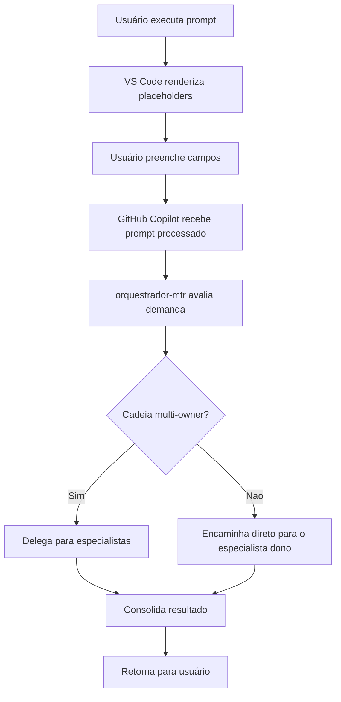

# Guia de Uso dos Prompts Interativos

## Visão Geral

Todos os prompts em `.github/prompts/` foram otimizados para uso direto no VS Code através do GitHub Copilot Chat.

**Features implementadas:**

- ✅ YAML frontmatter com metadados do agente responsável
- ✅ Placeholders nativos `${input:chave:valor-padrao}`
- ✅ Compatibilidade com execução direta no VS Code Copilot Chat
- ✅ Integração com estrutura de agentes, skills e instructions

## Como usar no VS Code

### 1. Via Chat Panel

1. Abra o GitHub Copilot Chat (`Ctrl+Shift+I` ou `Cmd+Shift+I`)
2. Use o comando `/` para listar prompts disponíveis
3. Selecione o prompt desejado
4. Preencha os campos interativos
5. Execute

### 2. Via Context Menu

1. Clique com botão direito no arquivo `.prompt.md`
2. Selecione "GitHub Copilot" → "Execute in New Chat" ou "Execute in Current Chat"
3. Preencha os placeholders
4. Execute

> Importante: em `Exemplo de uso`, evite referência de arquivo apontando para o próprio `.prompt.md`.
> O diagnostics provider pode avaliar isso como arquivo não encontrado dependendo do contexto de resolução.
> Prefira texto como: `No VS Code Copilot Chat, execute o prompt \`nome-do-prompt\``.

### 3. Via Command Palette

1. `Ctrl+Shift+P` (ou `Cmd+Shift+P`)
2. Digite "GitHub Copilot: Run Prompt"
3. Selecione o prompt
4. Preencha os campos
5. Execute

## Prompts Disponíveis

### Handoffs (✅ ATUALIZADO 2026-03-23)

#### `handoff.prompt.md`

**Quando usar:** executar demanda multi-camada completa com decomposição, handoffs por fase, validações e consolidação final

#### `handoff-plan.prompt.md`

**Quando usar:** pedir apenas o planejamento executável da demanda antes de iniciar a execução

#### `handoff-execute.prompt.md`

**Quando usar:** iniciar a execução por fases de uma demanda já definida, com contexto adicional se necessário

#### `handoff-track.prompt.md`

**Quando usar:** acompanhar progresso, bloqueios, responsáveis e próximos passos de uma execução ligada a `DL-XXX`

### Operacionais (Uso Diário)

#### `desenvolver-feature-completa.prompt.md`

**Quando usar:** implementar nova funcionalidade end-to-end

**Placeholders:**

- `feature_description` (obrigatório): descrição da feature
- `acceptance_criteria` (opcional): critérios de aceite

**Exemplo:**

```text
Feature: implementar endpoint POST /v1/manifestos/:id/reopen
Critérios: só pode reabrir se status=cancelled e elapsed < 48h
```

#### `resolver-bug-critico.prompt.md`

**Quando usar:** bug em produção/staging

**Placeholders:**

- `bug_symptom` (obrigatório): erro, stack trace, comportamento incorreto
- `correlation_id` (opcional): ID para rastreamento
- `environment` (select): produção/staging/local

**Exemplo:**

```text
Sintoma: POST /v1/manifestos/:id/submit retorna 500 com resNome vazio
CorrelationId: abc-123-def
Ambiente: produção
```

#### `hardening-producao.prompt.md`

**Quando usar:** preparar sistema para produção

**Placeholders:**

- `deployment_timeline` (obrigatório): timeline de deploy
- `focus_areas` (multiselect): áreas prioritárias
- `specific_concerns` (opcional): preocupações específicas

**Exemplo:**

```text
Timeline: em 1 semana
Áreas: [x] Integração CETESB [x] Fila/Worker [x] Observabilidade
Preocupações: validar DLQ sob carga real
```

### Técnicos (Orquestração)

#### `escalar-demanda-completa.prompt.md`

**Quando usar:** demanda complexa multi-camada

**Placeholders:**

- `demanda` (obrigatório): objetivo, escopo, restrições, definição de pronto

#### `implementar-proximo-passo.prompt.md`

**Quando usar:** seguir backlog atual

**Placeholders:**

- `tarefa` (obrigatório): tarefa desejada ou "seguir backlog atual"

#### `criar-ou-ajustar-testes.prompt.md`

**Quando usar:** criar/ajustar testes

**Placeholders:**

- `alvo` (obrigatório): arquivo, endpoint ou fluxo
- `test_types` (multiselect): tipos de teste desejados

#### `revisar-contrato-openapi.prompt.md`

**Quando usar:** validar consistência do OpenAPI

**Placeholders:**

- `escopo` (obrigatório): endpoint específico ou "revisão geral"
- `validation_areas` (multiselect): áreas a validar

#### `validar-fluxo-cetesb.prompt.md`

**Quando usar:** validar integração CETESB

**Placeholders:**

- `fluxo` (select): login, submit, print, cancel, etc.
- `focus` (multiselect): token, payload, persistência, retry, testes

### Auditoria Externa

#### `auditar-navegacao-cetesb-playwright.prompt.md`

**Quando usar:** navegar em sistema externo com Playwright de forma assistida e segura, registrando telas, requests, payloads e checkpoints humanos sem persistir credenciais no repositório; se houver CAPTCHA ou perda da janela, o fluxo deve ficar em espera e retomar a mesma fase

**Placeholders:**

- `work_id` (obrigatório): identificador estável do handoff que receberá a auditoria
- `target_url` (obrigatório): URL do sistema externo a ser auditado
- `operational_profile` (obrigatório): papel ou contexto operacional usado na sessão
- `login_email` (obrigatório): login informado em runtime
- `credential_secret` (obrigatório): segredo fornecido apenas no momento da execução
- `sensitive_flows_allowed` (obrigatório): se fluxos sensíveis podem ser alcançados durante a navegação
- `stop_before_mutation` (obrigatório): se a auditoria deve parar antes de qualquer ação mutável
- `navigation_scope` (obrigatório): telas ou jornadas que podem ser exploradas
- `sicat_correlation_scope` (opcional): arquivos ou áreas do frontend SICAT para correlação de payloads

**Exemplo:**

```text
Work ID: cetesb-playwright-navigation-audit
URL: https://mtr.cetesb.sp.gov.br/#/
Perfil: gerador
Login: informado em runtime
Segredo: informado em runtime e nunca persistido
Fluxos sensíveis permitidos: não
Parar antes de mutação: sim
Escopo: login, create, receive, download, register
Correlação SICAT: frontend/src/views e frontend/src/services
```

**Retomada esperada:** se a sessão for bloqueada por checkpoint humano ou perda da janela ativa, o agente deve responder apenas com a espera objetiva por desbloqueio do usuário, registrar `awaiting_user_unblock_in_chat` no handoff da fase e retomar a mesma auditoria quando houver nova sessão.

#### `iniciar-frente-operacional-coordenada.prompt.md`

**Quando usar:** abrir uma execução observável da frente operacional coordenada com board, briefings e status por lane

**Placeholders:**

- `dl_id` (obrigatório): DL que vai receber os artefatos operacionais
- `demanda_observavel` (obrigatório): título/objetivo da frente coordenada
- `contexto_observavel` (opcional): escopo, restrições e critérios de pronto

**Exemplo:**

```text
DL: DL-087
Demanda: endurecer observabilidade operacional e governança admin em pacote único
Contexto: backend + dashboard + jobs/logs + perfis com fechamento obrigatório em QA/docs
```

### Frontend (Vue + UX)

#### `frontend-feature-end-to-end.prompt.md`

**Quando usar:** implementar feature completa de frontend com integração backend em um único fluxo

**Placeholders:**

- `feature_e2e` (obrigatório): descrição ponta a ponta com UX, API e critérios

#### `arquitetar-frontend-vue.prompt.md`

**Quando usar:** criar ou evoluir frontend Vue integrado ao backend

**Placeholders:**

- `escopo_frontend` (obrigatório): fluxo/tela/módulo frontend alvo

#### `auditar-ux-css.prompt.md`

**Quando usar:** auditar UX, navegação e CSS avançado

**Placeholders:**

- `alvo_ux` (obrigatório): arquivo, pasta ou fluxo para auditoria

### Dashboard e Observabilidade

#### `evoluir-dashboard-observabilidade.prompt.md`

**Quando usar:** evoluir o dashboard com visão consolidada de métricas operacionais

**Placeholders:**

- `objetivo_dashboard` (obrigatório): melhoria desejada (KPI, tendência, latência, alerta)
- `criterios_aceite` (opcional): critérios objetivos de pronto

### Especialistas de Tela/Módulo (✅ ATUALIZADO 2026-03-15)

#### `evoluir-jobs-logs.prompt.md`

**Quando usar:** evoluir a operação administrativa global (usuários/sessões) e o monitoramento de Jobs e Logs

**Placeholders:**

- `melhoria_jobs` (obrigatório): descrição da evolução (auditoria por usuário/sessão, ações de manutenção, filtros, colunas, paginação, rastreabilidade)
- `criterios_aceite` (opcional): critérios objetivos de pronto

**Exemplo:**

```text
Melhoria: listar sessões ativas/inativas de todos os usuários com ação de revogar sessão e trilha de auditoria
Critérios: filtros por usuário/status de sessão, confirmação para revogação, histórico auditável por correlationId
```

#### `evoluir-sessao-conta.prompt.md`

**Quando usar:** evoluir a tela de Sessão e Conta CETESB

**Placeholders:**

- `melhoria_sessao` (obrigatório): descrição da evolução (status de sessão, troca de conta, expiração)
- `criterios_aceite` (opcional): critérios objetivos de pronto

**Exemplo:**

```text
Melhoria: indicador visual de tempo restante da sessão CETESB e aviso de expiração
Critérios: badge de status na topbar, alerta 5 min antes de expirar
```

#### `evoluir-manifestos.prompt.md`

**Quando usar:** evoluir a tela de Manifestos (lista/detalhe/criação/ações)

**Placeholders:**

- `melhoria_manifestos` (obrigatório): descrição da evolução (filtros, estados, ações, UX)
- `criterios_aceite` (opcional): critérios objetivos de pronto

**Exemplo:**

```text
Melhoria: exibir mensagem de erro CETESB em tooltip no status "falha" da listagem
Critérios: tooltip com texto legível, sem truncamento, copiável
```

#### `evoluir-perfis-acessos.prompt.md`

**Quando usar:** evoluir o módulo administrativo de Perfis e Acessos (RBAC/ABAC), incluindo nova tela de gestão com controle fino

**Placeholders:**

- `melhoria_perfis_acessos` (obrigatório): descrição da evolução (papéis, permissões, políticas, gestão de sessões/senha, auditoria)
- `criterios_aceite` (opcional): critérios objetivos de pronto

**Exemplo:**

```text
Melhoria: criar matriz de permissões por recurso/ação e permitir revogação de sessão por usuário
Critérios: bloqueio por falta de permissão, confirmação para revogar sessão e auditoria por correlationId/userId
```

#### `evoluir-estrutura-vscode.prompt.md`

**Quando usar:** evoluir a estrutura da pasta `.vscode` com foco em tarefas de execução local, debug e padronização de workspace

**Placeholders:**

- `melhoria_vscode` (obrigatório): descrição da evolução em `tasks/launch/settings/extensions`
- `criterios_aceite` (opcional): critérios objetivos de pronto

**Exemplo:**

```text
Melhoria: criar task composta para restart completo (api + worker + frontend) com validação de readiness
Critérios: task única executa sequência previsível e logs ficam em painéis dedicados
```

## Placeholders Nativos

Use placeholders nativos do runtime atual:

```text
${input:feature_description:Descreva a feature}
```

Evite sintaxes não suportadas, como `{{placeholder}}` e `template` no frontmatter.

## Integração com Agentes

Todos os prompts especificam o agente responsável no frontmatter:

```yaml
agent: orquestrador-mtr
```

Isso garante que:

- ✅ Escalonamento automático por domínio técnico
- ✅ Skills aplicadas corretamente
- ✅ Instructions respeitadas
- ✅ Handoffs para especialistas quando necessário
- ✅ Execução direta no especialista correto quando a solicitação for operacional e de owner único

## Memória orquestrada opcional

- Prompts que entram por `orquestrador-mtr` ou `executor-handoffs` podem reaproveitar memória de cadeia via mempalace quando o runtime disponibilizar esse MCP.
- Para continuidade, informe `work_id` ou checkpoint sempre que possível; o agente deve ler primeiro `docs/handoffs/<work_id>/` e só depois consultar mempalace.
- Se mempalace não estiver disponível, o comportamento dos prompts permanece o mesmo, sem dependência adicional.

## Fluxo de Execução



Regra prática: pedidos isolados para subir ambiente local, subir stack local, deixar localhost no ar ou preparar o ambiente para validar entram no caminho direto para `estrutura-vscode-mtr`; só viram cadeia quando fizerem parte de implementação, QA, documentação ou outro owner adicional.

## Boas Práticas

### 1. Use prompts operacionais para tarefas recorrentes

- Feature nova → `desenvolver-feature-completa`
- Bug urgente → `resolver-bug-critico`
- Pré-produção → `hardening-producao`

### 2. Seja específico nos placeholders

❌ Ruim: "fazer endpoint de reopen"
✅ Bom: "implementar POST /v1/manifestos/:id/reopen para reabrir MTR cancelado (regra: só se status=cancelled e elapsed < 48h)"

### 3. Aproveite valores default

Se o default faz sentido, apenas confirme sem editar.

### 4. Combine com contexto de arquivos

Adicione arquivos relevantes no chat para complementar o prompt (ex.: rota, service, schema e teste do fluxo impactado).

## Troubleshooting

### Prompt não aparece na lista

- Verifique se o arquivo tem extensão `.prompt.md`
- Confirme que o frontmatter YAML está válido
- Recarregue o VS Code

### Placeholders não renderizam

- Verifique sintaxe nativa: `${input:chave:valor-padrao}`
- Evite `{{placeholder}}` e `template:` no frontmatter
- Cheque se há erros no YAML frontmatter

### Agente não escala corretamente

- Verifique se o agente existe em `.github/agents/`
- Confirme que handoffs estão configurados
- Consulte `.github/agents/orquestrador-mtr.agent.md`

## Exemplos Práticos

### Feature completa

```text
1. Abrir Copilot Chat
2. Selecionar "desenvolver-feature-completa"
3. Preencher:
   - Feature: "endpoint GET /v1/manifestos/:id/pdf para baixar PDF gerado"
   - Critérios: "retornar 404 se PDF não existe, 200 com stream se existe"
4. Executar
```

### Bug crítico

```text
1. Clicar com direito em "resolver-bug-critico.prompt.md"
2. "Execute in New Chat"
3. Preencher:
   - Sintoma: "worker trava ao processar job com payload null"
   - CorrelationId: "corr_123"
   - Ambiente: "produção"
4. Executar
```

### Hardening

```text
1. Command Palette → "Run Prompt"
2. Selecionar "hardening-producao"
3. Preencher:
   - Timeline: "deploy em 2026-03-15"
   - Áreas: [x] Integração CETESB [x] DLQ [x] Observabilidade
4. Executar
```

## Referências

- Estrutura de agentes: `.github/README.md`
- Skills disponíveis: `.github/skills/*/SKILL.md`
- Instructions: `.github/instructions/*.instructions.md`
- Documentação técnica: `docs/copilot/14-estrutura-copilot.md`
