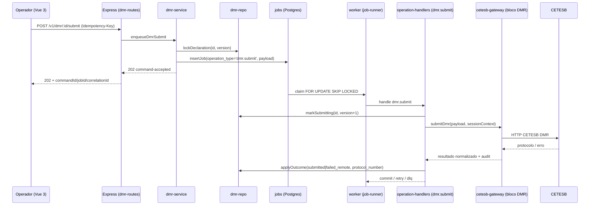

# Arquitetura alvo — DMR (Declaração de Movimentação de Resíduos) — SICAT

> Documento de arquitetura conceitual da **Frente 2** do backlog CTO
> ([docs/_inputs/fonte-de-verdade-backlog-cto.md](../_inputs/fonte-de-verdade-backlog-cto.md#frente-2-—-dmr-declaração-de-movimentação-de-resíduos)).
> Ancorado na cadeia [docs/handoffs/dmr-fluxo-base/00-orchestration.md](../handoffs/dmr-fluxo-base/00-orchestration.md).
> **Não inicia implementação.** Endpoints, esquemas de dados e UIs descritos
> abaixo são alvos das fases 02 a 09 da cadeia `dmr-fluxo-base`.

## 1. Definição funcional

A **DMR (Declaração de Movimentação de Resíduos)** é uma obrigação
declaratória prevista pelo SIGOR/CETESB-SP. O gerador (e, conforme o
papel, transportador, destinador e armazenador temporário) declara, em
janelas periódicas, a movimentação consolidada de resíduos tratada por
MTRs no período. A declaração é submetida à CETESB e fica registrada
como evidência de cumprimento da obrigação ambiental.

Hoje o SICAT **não tem suporte a DMR** (gap registrado em
[docs/_inputs/fonte-de-verdade-backlog-cto.md §4.4](../_inputs/fonte-de-verdade-backlog-cto.md#44-gap-de-backendcontrato)).
Esta arquitetura define o fluxo declaratório base equivalente ao do
SIGOR, respeitando a fronteira arquitetural do repositório.

Princípio condutor: **a DMR é um ciclo declaratório periódico**
(rascunho → consolidação → submissão → confirmação remota → arquivamento),
distinto do ciclo transacional do MTR (gerar/imprimir/cancelar/receber).
Por isso ganha tabela, services, rotas e UI próprios — sem reutilizar
`manifests`.

## 2. Posição na fronteira arquitetural

A DMR respeita a fronteira já estabelecida em
[AGENTS.md §2](../../AGENTS.md) e em
[docs/04-arquitetura/centro-operacional-sicat.md §4](centro-operacional-sicat.md#4-contratos-transversais):

```text
HTTP → src/routes/dmr-routes.ts              # mapeamento HTTP, sem lógica
        src/services/dmr-service.ts          # orquestração, idempotência, enqueue
          src/repositories/dmr-repo.ts       # SQL exclusivo de DMR
          jobs (tabela existente DL-022)     # fila transacional
            src/workers/operation-handlers.ts → handler `dmr.submit`
              src/gateways/cetesb-gateway.js → bloco DMR isolado
                                              (única exceção JS — DL-093)
```

**Regras invariantes**:

- nenhuma rota/serviço/worker fala diretamente com a CETESB; toda HTTP
  CETESB para DMR fica encapsulada em `src/gateways/cetesb-gateway.js`,
  preservando bootstrap de sessão via
  `src/services/session-context-service.ts`;
- `src/repositories/dmr-repo.ts` é a única camada que executa SQL contra
  as tabelas DMR;
- comandos DMR mutáveis retornam `202` + `command-accepted`, com job
  persistido (padrão `enqueueManifest*` em
  `src/services/manifest-service.ts`);
- erros são `application/problem+json` (`src/lib/problem.ts`);
- preserva `correlationId`, `jobId`, `commandId`, `sessionContextId`,
  `integrationAccountId` em todas as camadas;
- idempotência via `Idempotency-Key` em comandos
  (`src/services/idempotency-service.ts`).

## 3. Esquema de dados proposto

Todas as migrations devem ser idempotentes (`create table if not exists`,
`create index if not exists`) e seguir o padrão DL-022 (locking otimista
via `version`, FKs e constraints declaradas explicitamente).

### 3.1 `dmr_declarations` (tabela principal)

| coluna | tipo | obrigatório | nota |
| --- | --- | --- | --- |
| `id` | `uuid` | sim | PK; gerado em service. |
| `integration_account_id` | `uuid` | sim | FK → `integration_accounts(id)`. Conta CETESB titular. |
| `cnpj` | `text` | sim | CNPJ do declarante (espelhado da conta para auditoria). |
| `unit_code` | `text` | sim | Código da unidade/empreendimento na CETESB. |
| `role` | `text` | sim | Papel declarado: `gerador`, `transportador`, `destinador`, `armazenador_temporario`. |
| `period_start` | `date` | sim | Início da janela declaratória. |
| `period_end` | `date` | sim | Fim da janela declaratória. |
| `period_label` | `text` | sim | Rótulo amigável (ex.: `2026-Q1`, `2026-04`). |
| `status` | `text` | sim | Ciclo declaratório (ver §3.2). |
| `correlation_id` | `text` | sim | Trilha de auditoria. |
| `command_id` | `text` | não | Set durante submissão assíncrona. |
| `session_context_id` | `uuid` | não | Sessão CETESB usada na submissão. |
| `submitted_at` | `timestamptz` | não | Timestamp de aceite remoto. |
| `protocol_number` | `text` | não | Protocolo CETESB (preenchido pelo handler). |
| `remote_reference` | `text` | não | ID/hash retornado pela CETESB. |
| `summary_totals` | `jsonb` | sim | Totais consolidados (massa por classe, número de MTRs, etc.). |
| `payload_snapshot` | `jsonb` | sim | Snapshot do payload submetido (auditoria + replay). |
| `last_error_code` | `text` | não | Mapeável à taxonomia operacional. |
| `last_error_detail` | `jsonb` | não | Detalhe do último erro. |
| `attempts` | `int` | sim | Default `0`. |
| `version` | `int` | sim | Default `1` — locking otimista (DL-022). |
| `created_at` | `timestamptz` | sim | Default `now()`. |
| `updated_at` | `timestamptz` | sim | Default `now()`. |

**Constraints obrigatórias (DL-022)**:

- `chk_dmr_period_order`: `period_end >= period_start`.
- `chk_dmr_role_allowed`: `role in ('gerador','transportador','destinador','armazenador_temporario')`.
- `chk_dmr_status_allowed`: `status in (<lista §3.2>)`.
- `chk_dmr_submitted_consistency`: quando `status = 'submitted'`,
  `submitted_at is not null` e `protocol_number is not null`.
- `chk_dmr_attempts_nonneg`: `attempts >= 0`.

**Índices candidatos** (todos `create index if not exists`):

- `idx_dmr_account_status` em `(integration_account_id, status)`.
- `idx_dmr_period` em `(integration_account_id, period_start, period_end)`.
- `idx_dmr_correlation` em `(correlation_id)`.
- `idx_dmr_protocol` em `(protocol_number)` `where protocol_number is not null`.

### 3.2 Ciclo declaratório (`dmr_declarations.status`)

| status físico | descrição | mapeamento operacional (taxonomia §13 estados) |
| --- | --- | --- |
| `draft` | Rascunho aberto pelo operador | `ready` |
| `consolidating` | Coleta/consolidação automática em andamento | `running` |
| `pending_review` | Consolidado, aguardando revisão humana | `blocked_external_data` (decisão humana) |
| `enqueued` | Comando de submissão enfileirado | `ready` |
| `submitting` | Worker executando submit DMR contra CETESB | `running` |
| `awaiting_remote` | CETESB aceitou e está confirmando | `awaiting_remote_confirmation` |
| `submitted` | CETESB confirmou (protocolo presente) | `completed_with_document` |
| `failed_validation` | Validação local rejeitou | `failed_validation` |
| `failed_remote` | CETESB rejeitou | `failed_remote_contract` |
| `cancelled` | Cancelado antes de submeter | `failed_internal_processing` (terminal humano) |

> O mapeamento canônico `dmr.status → JobOperationalStatus` é
> responsabilidade do espelho em
> [src/lib/operational-status.ts](../../src/lib/operational-status.ts)
> e da taxonomia
> [docs/05-operacao/taxonomia-status-erros-operacionais.md](../05-operacao/taxonomia-status-erros-operacionais.md).
> A fase 06-domain-rules estende o registry sem inventar bucket novo.

### 3.3 `dmr_declaration_items` (linhas/manifestos consolidados)

| coluna | tipo | nota |
| --- | --- | --- |
| `id` | `uuid` | PK. |
| `declaration_id` | `uuid` | FK → `dmr_declarations(id)` `on delete cascade`. |
| `manifest_id` | `uuid` | FK opcional → `manifests(id)` (quando o item veio de um MTR SICAT). |
| `mtr_number` | `text` | Número do MTR referenciado (sempre presente). |
| `cdf_number` | `text` | CDF associado, quando houver. |
| `residue_class` | `text` | Classe (I, IIA, IIB, etc.). |
| `residue_code` | `text` | Código IBAMA/ONU/CETESB. |
| `quantity_value` | `numeric(18,4)` | Quantidade declarada. |
| `quantity_unit` | `text` | Unidade (`kg`, `t`, `m3`, `L`). |
| `partner_role` | `text` | `transportador` / `destinador` / `armazenador`. |
| `partner_cnpj` | `text` | CNPJ do parceiro. |
| `metadata` | `jsonb` | Campos extras conforme HAR DMR. |
| `created_at` | `timestamptz` | Default `now()`. |

Índice candidato: `idx_dmr_items_decl` em `(declaration_id)`.

### 3.4 Reuso de tabelas existentes

- `jobs` (DL-022) recebe operações do tipo `dmr.submit` — sem alterar
  schema nem constraints existentes.
- `audit_exchanges` (existente) registra todo request/response do gateway
  DMR.
- `session_contexts` (existente) provê o JWT CETESB para a submissão.
- `integration_accounts` (existente) é a chave de unicidade de DMR.

**Não é necessário alterar nenhuma tabela existente**.

## 4. Fluxos críticos

### 4.1 Diagrama de sequência (submissão DMR)



### 4.2 Endpoints HTTP propostos (a contratualizar na fase 04)

| método | path | tipo | descrição |
| --- | --- | --- | --- |
| `POST` | `/v1/dmr` | comando síncrono | Cria declaração rascunho. |
| `GET` | `/v1/dmr` | read-only | Lista declarações (filtros: período, status, role). |
| `GET` | `/v1/dmr/:id` | read-only | Detalhe + itens consolidados. |
| `GET` | `/v1/dmr/pendentes` | read-only | DMRs em janela aberta sem submissão. |
| `POST` | `/v1/dmr/:id/consolidate` | comando síncrono | Refaz consolidação a partir de MTRs do período. |
| `POST` | `/v1/dmr/:id/submit` | comando assíncrono `202` | Enfileira `dmr.submit`. |
| `GET` | `/v1/dmr/:id/status` | read-only | Status enriquecido (taxonomia operacional). |
| `DELETE` | `/v1/dmr/:id` | comando síncrono | Cancela rascunho (apenas em `draft`/`pending_review`). |

### 4.3 Worker handler

Novo case em `src/workers/operation-handlers.ts`:

- `dmr.submit`: lê snapshot, garante sessão CETESB válida, chama
  `gateway.submitDmr`, persiste protocolo, registra exchange auditado,
  atualiza `status` segundo §3.2, respeita retry/DLQ existentes.

Não introduz worker novo — reutiliza
`src/workers/job-runner.ts` (DL-022).

## 5. Mapeamento contra evidência CETESB

Inventário de [docs/cetesb/](../cetesb/) confirmado em 2026-04-25:

| arquivo | cobre DMR? | observação |
| --- | --- | --- |
| `mtr.cetesb.sp.gov.br_login.har` | indireto | Útil para bootstrap de sessão DMR (mesmo login CETESB). |
| `mtr.cetesb.sp.gov.br_gerar_mtr.har` | não | MTR transacional. |
| `mtr.cetesb.sp.gov.br_imprimir_mtr.har` | não | MTR transacional. |
| `mtr.cetesb.sp.gov.br_cancelar_mtr.har` | não | MTR transacional. |
| `mtr.cetesb.sp.gov.br_recebimento_mtr.har` | não | MTR transacional. |
| `mtr.cetesb.sp.gov.br_gerar_cdf_mtr.har` | não | CDF. |
| `mtr.cetesb.sp.gov.br_baixar_cdf_mtr.har` | não | CDF. |
| `mtr.cetesb.sp.gov.br_criar_cadastro.har` | não | Cadastro de parceiros. |

> **Lacuna documentada — bloqueante para a fase 03 (gateway DMR)**:
> não há HAR do fluxo DMR no repositório.
> A captura é responsabilidade explícita da
> **fase 02-source-validation** (`validador-cetesb-mtr`).
> Mínimo a capturar:
>
> 1. `mtr.cetesb.sp.gov.br_listar_dmr.har` — listagem/pendentes;
> 2. `mtr.cetesb.sp.gov.br_consolidar_dmr.har` — consolidação a partir
>    de MTRs do período (se a CETESB expuser endpoint próprio);
> 3. `mtr.cetesb.sp.gov.br_enviar_dmr.har` — submissão da declaração
>    (caminho feliz);
> 4. `mtr.cetesb.sp.gov.br_consultar_dmr.har` — consulta de status /
>    protocolo de uma DMR submetida;
> 5. (opcional) `mtr.cetesb.sp.gov.br_baixar_dmr.har` — download do
>    comprovante/PDF, se existir.
>
> Sem essa evidência, o bloco DMR no gateway **não pode** ser
> implementado (DL-093: nada de endpoint hardcoded). A fase 02 deve
> também atualizar [docs/cetesb/README.md](../cetesb/README.md) com
> o novo inventário e referenciar os HARs em
> [tests/unit/cetesb-source-of-truth.test.js](../../tests/unit/cetesb-source-of-truth.test.js)
> caso já exista contrato espelhado.

## 6. Lockstep: artefatos a tocar nas fases posteriores

Toda mudança de superfície HTTP **exige** atualização sincronizada
([copilot-instructions §Conventions](../../.github/copilot-instructions.md)).
Mapa por fase:

### Fase 03 — `integrador-cetesb-mtr`

- `src/gateways/cetesb-gateway.js` — adicionar bloco DMR (login reuse,
  endpoints DMR descobertos via HAR, parsing tolerante).
- `tests/source-of-truth/` — espelho do HAR DMR (caso o validador
  consolide).

### Fase 04 — `programador-backend-mtr`

- `openapi/mtr_automacao_openapi_interna.yaml` — novos paths `/v1/dmr/*`,
  novos schemas `Dmr`, `DmrItem`, `DmrSubmitCommand`, `DmrCommandAccepted`.
- `examples/` — pelo menos um par request/response por operação:
  - `post_v1_dmr_request.json` / `_response.json`
  - `get_v1_dmr_request.json` / `_response.json`
  - `get_v1_dmr_id_request.json` / `_response.json`
  - `get_v1_dmr_pendentes_request.json` / `_response.json`
  - `post_v1_dmr_id_consolidate_request.json` / `_response.json`
  - `post_v1_dmr_id_submit_request.json` / `_response.json`
  - `get_v1_dmr_id_status_request.json` / `_response.json`
  - `delete_v1_dmr_id_request.json` / `_response.json`
- `src/generated/operations.ts` — regerar via `npm run gen:operations`.
- `src/routes/api-routes.ts` — registrar novas rotas (ou novo arquivo
  `src/routes/dmr-routes.ts` montado pelo agregador).
- `src/services/dmr-service.ts` — criar.

### Fase 05 — `postgres-queue-mtr`

- `src/sql/013_dmr_tables.sql` (próximo número livre — confirmar) —
  migration idempotente das tabelas e constraints §3.
- `src/repositories/dmr-repo.ts` — criar.
- `src/workers/operation-handlers.ts` — novo case `dmr.submit`.
- `src/lib/operational-status.ts` — estender mapeamento §3.2 sem alterar
  os 13 estados canônicos.

### Fase 06 — `manifestos-operacional-mtr`

- `src/lib/validators/dmr-validator.ts` — validações declaratórias.
- testes unitários do validador.

### Fase 07 — `frontend-vue-ux-mtr`

- `frontend/src/modules/dmr/` (sugerido, alinhado a
  [FRONTEND-COMPONENTS-ARCHITECTURE](../FRONTEND-COMPONENTS-ARCHITECTURE.md)).
- `frontend/src/router.js` — rotas `/dmr`, `/dmr/novo`, `/dmr/:id`,
  `/dmr/pendentes`.
- `frontend/src/services/dmr-service.js` — cliente HTTP.
- `frontend/tests/ui/dmr.spec.ts` — Playwright base.

### Fase 08 — `tester-qa-mtr`

- `tests/integration/dmr-*.test.js`
- `tests/api/dmr-*.test.js`
- `tests/worker/dmr-handler.test.js`
- `npm run test:contract` continua verde (forçado pela regeneração de
  `operations.ts`).

### Fase 09 — `documentador-mtr`

- `docs/10-estado-atual/estado-atual.md` — DMR como IMPLEMENTADO.
- `docs/10-estado-atual/PROXIMO_PROMPT.md` — apontar próxima frente
  (Frente 3 — MTR provisório, conforme backlog CTO).
- `docs/CHANGELOG-DMR.md` (novo) — release notes.

## 7. Riscos e suposições

- **R1 — HAR DMR ausente** (bloqueante para fase 03): mitigação na fase
  02 com captura completa em modo real (conta de teste CETESB).
- **R2 — Periodicidade não normalizada**: o backlog CTO não define se
  a janela é mensal/trimestral/anual; **suposição** = aceitar janela
  arbitrária `[period_start, period_end]` e deixar o operador escolher,
  limitando o servidor a validar `period_end >= period_start`.
- **R3 — Consolidação automática vs manual**: **suposição** = oferecer
  consolidação automática a partir de MTRs SICAT do período, mas
  permitir edição manual antes da submissão (status `pending_review`).
- **R4 — Reuso indevido de `manifests`**: tentação de empurrar DMR para
  a tabela `manifests`. **Decisão**: tabela própria
  (`dmr_declarations`/`dmr_declaration_items`) — ciclo de vida
  declaratório é distinto e fundir comprometeria índices/constraints.
- **R5 — Locking otimista**: toda mutação em `dmr_declarations` deve
  usar `version = version + 1` e cláusula `where version = $expected`
  (DL-022).
- **R6 — Idempotência**: `POST /v1/dmr/:id/submit` é único ponto onde
  retry de cliente pode duplicar — exige `Idempotency-Key` e replay
  via `idempotency-service`.

## 8. Critérios de pronto da cadeia (replicado de
[00-orchestration §4](../handoffs/dmr-fluxo-base/00-orchestration.md))

- evidência HAR DMR validada e referenciada;
- OpenAPI publicada com novos endpoints DMR e operations geradas em
  lockstep;
- migrations idempotentes (`create index if not exists`; sem alterar
  constraints DL-022; preservando locking otimista);
- nenhum acesso CETESB fora de `src/gateways/cetesb-gateway.js`;
- testes verdes: `test:api`, `test:integration`, `test:worker`,
  `test:contract`, `test:source-of-truth`, `smoke:health`,
  `smoke:openapi`;
- pelo menos uma spec Playwright cobrindo o fluxo DMR principal;
- [docs/10-estado-atual/estado-atual.md](../10-estado-atual/estado-atual.md)
  atualizado com DMR como IMPLEMENTADO e novo
  [PROXIMO_PROMPT.md](../10-estado-atual/PROXIMO_PROMPT.md) apontando a
  frente seguinte.
