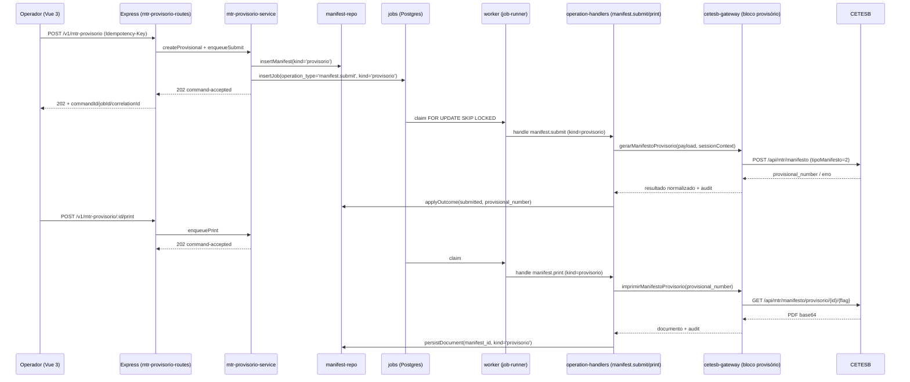

# Arquitetura alvo — MTR provisório — SICAT

> Documento de arquitetura conceitual da **Frente 3** do backlog CTO
> ([docs/_inputs/fonte-de-verdade-backlog-cto.md §4.4 e §5](../_inputs/fonte-de-verdade-backlog-cto.md)).
> Ancorado na cadeia
> [docs/handoffs/mtr-provisorio-fluxo-base/00-orchestration.md](../handoffs/mtr-provisorio-fluxo-base/00-orchestration.md).
> **Não inicia implementação.** Endpoints, esquemas de dados e UIs descritos
> abaixo são alvos das fases 02 a 09 da cadeia
> `mtr-provisorio-fluxo-base`.

## 1. Definição funcional

O **MTR provisório** é uma variante do Manifesto de Transporte de
Resíduos prevista pelo SIGOR/CETESB-SP, usada quando o gerador precisa
movimentar resíduos antes que o MTR definitivo possa ser emitido — por
exemplo, em situações de coleta emergencial, transbordo controlado ou
armazenamento temporário onde o número definitivo só será conhecido
após o recebimento final. O ciclo é equivalente ao do MTR comum
(cadastro → emissão → impressão → eventual recebimento), porém com
discriminador explícito (`tipoManifesto = provisório`) e número
próprio (`mtrProvisorioNumero`) que depois é referenciado pelo MTR
definitivo correspondente.

Hoje o SICAT **não tem suporte nativo a MTR provisório** (gap
registrado em
[docs/_inputs/fonte-de-verdade-backlog-cto.md §4.4](../_inputs/fonte-de-verdade-backlog-cto.md)).
Os dados existentes no SICAT são exclusivamente do MTR definitivo
(`tipoManifesto = 1`). Esta arquitetura define o fluxo base de
cadastro, listagem, detalhe e impressão de MTR provisório respeitando
a fronteira arquitetural do repositório.

Princípio condutor: **MTR provisório é uma variante transacional do
mesmo objeto manifesto** — não justifica tabela própria nem ciclo
declaratório separado (diferente de DMR). Entra como discriminador
explícito sobre o domínio existente, com superfície HTTP dedicada para
não poluir o contrato genérico de `/v1/manifestos`.

## 2. Posição na fronteira arquitetural

A solução respeita a fronteira já estabelecida em
[AGENTS.md §2](../../AGENTS.md) e em
[docs/04-arquitetura/centro-operacional-sicat.md §4](centro-operacional-sicat.md):

```text
HTTP → src/routes/mtr-provisorio-routes.ts        # mapeamento HTTP, sem lógica
        src/services/mtr-provisorio-service.ts    # orquestração, idempotência, enqueue
          src/repositories/manifest-repo.ts       # SQL — reuso da tabela manifests
          jobs (tabela existente DL-022)          # fila transacional
            src/workers/operation-handlers.ts     → handler `manifest.print` (reaproveitado)
              src/gateways/cetesb-gateway.js      → bloco `gerar/imprimir provisório`
                                                    com `tipoManifesto = 2`
```

**Regras invariantes**:

- nenhuma rota/serviço/worker fala diretamente com a CETESB; toda HTTP
  CETESB para MTR provisório fica encapsulada em
  `src/gateways/cetesb-gateway.js`, preservando bootstrap de sessão via
  `src/services/session-context-service.ts`;
- SQL fica restrito a `src/repositories/**`;
- comandos assíncronos retornam `202` + `command-accepted` com job
  persistido (padrão `enqueueManifest*` em
  [src/services/manifest-service.ts](../../src/services/manifest-service.ts));
- erros são `application/problem+json`
  ([src/lib/problem.ts](../../src/lib/problem.ts));
- preserva `correlationId`, `jobId`, `commandId`, `sessionContextId`,
  `integrationAccountId` em todas as camadas;
- idempotência via `Idempotency-Key` em comandos
  ([src/services/idempotency-service.ts](../../src/services/idempotency-service.ts)).

## 3. Esquema preliminar de persistência

**Decisão**: reutilizar a tabela `manifests` existente, adicionando um
discriminador tipado. Nenhuma constraint DL-022 é alterada; apenas
colunas idempotentes são adicionadas.

### 3.1 Migrations propostas (alvo da fase 05)

Migration única `src/sql/0XX_manifests_mtr_provisorio.sql` (próximo
número livre — confirmar na fase 05), idempotente:

```sql
alter table manifests
  add column if not exists kind text not null default 'definitivo';

alter table manifests
  add column if not exists provisional_number text;

alter table manifests
  add column if not exists provisional_received_at timestamptz;

alter table manifests
  add column if not exists definitive_manifest_id uuid
    references manifests(id);

create index if not exists idx_manifests_kind
  on manifests(integration_account_id, kind);

create index if not exists idx_manifests_provisional_number
  on manifests(provisional_number)
  where provisional_number is not null;
```

**Constraints novas (idempotentes via `do $$ ... end $$` ou
`add constraint if not exists`)**:

- `chk_manifests_kind_allowed`: `kind in ('definitivo','provisorio')`.
- `chk_manifests_provisional_consistency`: quando `kind = 'provisorio'`,
  `provisional_number` é obrigatório a partir do momento em que
  `status` indica emissão concluída.

**Não tocar**:

- as 5 constraints de consistência DL-022 (submitted, finished,
  running, retry_wait, attempts);
- coluna `version` (locking otimista preservado);
- triggers existentes (incluindo `increment_version`).

### 3.2 Mapeamento à taxonomia operacional

O ciclo de status físicos do MTR provisório é o mesmo do MTR
definitivo (`draft`, `enqueued`, `submitting`, `awaiting_remote`,
`submitted`, `printed`, `failed_validation`, `failed_remote`,
`cancelled`). Nenhum estado novo é introduzido — apenas o mapeamento
existente em
[src/lib/operational-status.ts](../../src/lib/operational-status.ts)
é reaproveitado integralmente.

A fase 06-domain-rules deve confirmar que o registry tipado não
precisa de bucket adicional para a variante `kind = 'provisorio'`.

### 3.3 Reuso de tabelas existentes

- `jobs` (DL-022) recebe operações `manifest.submit` e
  `manifest.print` — sem novo `operation_type`, apenas com payload que
  carrega `kind = 'provisorio'` e flags do gateway. Vide §4.3.
- `audit_exchanges` (existente) registra request/response do gateway
  com tag de variante.
- `session_contexts`, `integration_accounts`, `manifest_documents` —
  reaproveitados sem alteração.

## 4. Fluxos críticos

### 4.1 Diagrama de sequência (criação + impressão)



### 4.2 Endpoints HTTP propostos (a contratualizar na fase 04)

A decisão entre **família dedicada** vs **flag tipada em
`/v1/manifestos`** está em §4.4. A tabela abaixo assume a recomendação
inicial (família dedicada).

| método | path | tipo | descrição |
| --- | --- | --- | --- |
| `POST` | `/v1/mtr-provisorio` | comando assíncrono `202` | Cria manifesto provisório e enfileira `manifest.submit`. |
| `GET` | `/v1/mtr-provisorio` | read-only | Lista manifestos provisórios (filtros equivalentes a `/v1/manifestos`). |
| `GET` | `/v1/mtr-provisorio/:id` | read-only | Detalhe + número provisório + vínculo com definitivo (quando houver). |
| `POST` | `/v1/mtr-provisorio/:id/print` | comando assíncrono `202` | Enfileira `manifest.print` para a variante provisória. |
| `GET` | `/v1/mtr-provisorio/:id/documents/:documentId` | read-only | Download do PDF provisório (reuso de `manifest_documents`). |
| `DELETE` | `/v1/mtr-provisorio/:id` | comando síncrono | Cancela rascunho local antes de submissão. |

**Fora do escopo desta cadeia base**:

- conversão automática provisório → definitivo (Frente 3 evolução);
- batch-create / batch-print (avaliar após base);
- recebimento/CDF da variante provisória (depende do MTR definitivo
  correspondente; tratar em cadeia subsequente).

### 4.3 Worker handler

**Não cria handler novo**. Os handlers `manifest.submit` e
`manifest.print` em
[src/workers/operation-handlers.ts](../../src/workers/operation-handlers.ts)
passam a inspecionar `payload.kind`:

- `kind === 'definitivo'` (default): caminho atual, sem mudança;
- `kind === 'provisorio'`: chama o bloco provisório do gateway,
  persiste `provisional_number` no campo dedicado (em vez de
  `mtr_number`).

Retry, DLQ, locking otimista e audit exchange permanecem inalterados.

### 4.4 Decisão arquitetural-chave (a confirmar na fase 04)

**Pergunta**: superfície HTTP do MTR provisório deve ser uma
**família nova** `/v1/mtr-provisorio/*` ou uma **variante** de
`/v1/manifestos/*` com flag tipada `kind`?

#### Opção A — Família dedicada `/v1/mtr-provisorio/*`

Prós:

- separação clara no OpenAPI, examples e RBAC;
- frontend pode reusar componentes mas com módulo dedicado
  (`frontend/src/modules/mtr-provisorio/`), alinhado a
  [FRONTEND-COMPONENTS-ARCHITECTURE](../FRONTEND-COMPONENTS-ARCHITECTURE.md);
- listagem e filtros nativamente segregados (sem precisar de
  `?kind=provisorio` em todos os clientes legados);
- política de futura conversão provisório → definitivo fica
  evidente como recurso cross-família (`POST /v1/manifestos/from-provisorio/:id`);
- backlog CTO trata MTR provisório como **frente independente**
  ([§5 — Frente 3](../_inputs/fonte-de-verdade-backlog-cto.md));
  endpoint dedicado materializa essa fronteira.

Contras:

- duplicação de schemas similares em OpenAPI (mitigável com
  `$ref` reaproveitando blocos de `/v1/manifestos`);
- mais artefatos de lockstep (rotas, services, examples);
- risco de divergência sutil entre as duas famílias se evoluírem
  separadas.

#### Opção B — Variante `/v1/manifestos?kind=provisorio` + payload tipado

Prós:

- contrato menor, um único caminho de listagem/detalhe;
- reuso natural de toda a infraestrutura existente
  (`manifest-service`, `manifest-repo`, validador, frontend);
- menos OpenAPI/examples para manter.

Contras:

- explosão de combinações implícitas em filtros, RBAC e UX;
- frontend tem que ramificar em runtime conforme `kind`,
  poluindo componentes hoje monolíticos;
- retrocompatibilidade frágil: clientes que ignoram `kind` podem
  receber objetos provisórios em listagens definitivas;
- backlog CTO trata como frente independente — uma flag empurraria
  decisões de produto para parametrização HTTP.

#### Recomendação inicial (a confirmar na fase 04)

**Opção A — família dedicada `/v1/mtr-provisorio/*`**, com
**persistência única na tabela `manifests`** (coluna `kind`).

Justificativa:

1. backlog CTO trata MTR provisório como Frente 3 distinta — superfície
   HTTP dedicada espelha a fronteira de produto;
2. RBAC, métricas operacionais e o futuro Centro Operacional
   (cadeia `centro-operacional-sicat`) ganham granularidade gratuita
   ao tratar a variante como família própria;
3. evita poluir clientes legados de `/v1/manifestos` que não esperam o
   discriminador;
4. persistência única em `manifests` mantém o custo baixo
   (sem nova tabela, sem migração disruptiva, locking otimista
   intacto);
5. handlers `manifest.submit` / `manifest.print` reaproveitados via
   `payload.kind` minimizam duplicação na fila e no worker.

A fase 04 (`programador-backend-mtr`) deve **confirmar ou refutar**
essa recomendação à luz da evidência consolidada na fase 02 e do
contrato CETESB observado no gateway (fase 03).

## 5. Mapeamento contra evidência CETESB

Inventário cruzado de [docs/cetesb/](../cetesb/) confirmado em
2026-04-25:

| arquivo | cobre MTR provisório? | observação |
| --- | --- | --- |
| `mtr.cetesb.sp.gov.br_login.har` | indireto | Bootstrap de sessão. Reaproveitado integralmente. |
| `mtr.cetesb.sp.gov.br_gerar_mtr.har` | **parcial — confirmado** | Contém URL `/api/mtr/manifesto/provisorio/{parCodigo}/{flag}` (resposta de listagem) e payload com `tipoManifesto`, `mtrProvisorioNumero`, `mtrProvisorioDataRecebimento`. Suficiente como ponto de partida para criação e listagem, **mas** caminho feliz de criação de provisório (request) precisa ser confirmado pelo validador. |
| `mtr.cetesb.sp.gov.br_imprimir_mtr.har` | **parcial — confirmado** | Resposta de listagem inclui `tipoManifesto` e `mtrProvisorioNumero`, evidenciando que o mesmo endpoint serve ambos os tipos. Caminho de impressão dedicado para provisório (`/api/mtr/manifesto/provisorio/...`) precisa confirmação. |
| `mtr.cetesb.sp.gov.br_cancelar_mtr.har` | a validar | Provavelmente reaproveitável; fora do escopo da cadeia base. |
| `mtr.cetesb.sp.gov.br_recebimento_mtr.har` | fora do escopo | Recebimento de provisório fica para cadeia subsequente. |
| `mtr.cetesb.sp.gov.br_gerar_cdf_mtr.har` | não | CDF, fora do escopo. |
| `mtr.cetesb.sp.gov.br_baixar_cdf_mtr.har` | não | CDF, fora do escopo. |
| `mtr.cetesb.sp.gov.br_criar_cadastro.har` | não | Cadastro de parceiros. |

### Reuso vs adaptação vs nova captura

- **Reaproveita do MTR comum**:
  - bootstrap de sessão (login HAR);
  - estrutura de payload de manifesto (parceiros, resíduos, transporte);
  - endpoint base `/api/mtr/manifesto` com discriminador `tipoManifesto`;
  - listagem unificada que retorna ambos os tipos;
  - persistência de `manifest_documents` para o PDF.
- **Precisa adaptação no gateway**:
  - rota dedicada `/api/mtr/manifesto/provisorio/{parCodigo}/{flag}`
    para listagem filtrada (já presente no HAR `gerar_mtr`);
  - parse de `mtrProvisorioNumero` em vez de `manNumero` para a
    variante;
  - endpoint de impressão da variante provisória — **a validar**.
- **Pode exigir nova captura humana** (lacuna a documentar pelo
  validador na fase 02):
  - request real de **criação** de MTR provisório (fluxo do
    operador no portal CETESB clicando "novo MTR provisório") — o
    HAR `gerar_mtr` parece capturar criação de MTR definitivo;
  - request real de **impressão** de MTR provisório, se o endpoint
    diferir do MTR comum;
  - resposta de **detalhe** (`GET` por número provisório), caso
    exista endpoint dedicado.

A fase 02 (`validador-cetesb-mtr`) deve produzir veredicto formal
sobre quais HARs adicionais são necessários antes da fase 03.

## 6. Lockstep: artefatos a tocar nas fases posteriores

Toda mudança de superfície HTTP **exige** atualização sincronizada
([copilot-instructions §Conventions](../../.github/copilot-instructions.md)).
Mapa por fase, assumindo a recomendação §4.4 (família dedicada):

### Fase 03 — `integrador-cetesb-mtr`

- [src/gateways/cetesb-gateway.js](../../src/gateways/cetesb-gateway.js)
  — adicionar bloco `mtr-provisorio` (criação, listagem, impressão),
  reaproveitando bootstrap de sessão e audit exchange existentes;
- [tests/unit/cetesb-source-of-truth.test.js](../../tests/unit/cetesb-source-of-truth.test.js)
  — espelhar payloads canônicos confirmados pelo HAR.

### Fase 04 — `programador-backend-mtr`

- [openapi/mtr_automacao_openapi_interna.yaml](../../openapi/mtr_automacao_openapi_interna.yaml)
  — novos paths `/v1/mtr-provisorio/*`, novos schemas
  `MtrProvisorio`, `MtrProvisorioListItem`,
  `MtrProvisorioCreateCommand`, `MtrProvisorioCommandAccepted`
  (preferir `$ref` para blocos compartilhados com `Manifesto`);
- [examples/](../../examples/) — pelo menos um par request/response por operação:
  - `post_v1_mtr_provisorio_request.json` / `_response.json`
  - `get_v1_mtr_provisorio_request.json` / `_response.json`
  - `get_v1_mtr_provisorio_id_request.json` / `_response.json`
  - `post_v1_mtr_provisorio_id_print_request.json` / `_response.json`
  - `get_v1_mtr_provisorio_id_documents_documentId_request.json` / `_response.json`
  - `delete_v1_mtr_provisorio_id_request.json` / `_response.json`
- [src/generated/operations.ts](../../src/generated/operations.ts) — regerar via `npm run gen:operations`;
- [src/routes/api-routes.ts](../../src/routes/api-routes.ts) — registrar novo agregador `mtr-provisorio-routes.ts`;
- `src/services/mtr-provisorio-service.ts` — criar (orquestração, idempotência, enqueue).

### Fase 05 — `postgres-queue-mtr`

- `src/sql/0XX_manifests_mtr_provisorio.sql` (próximo número livre —
  confirmar na fase 05) — migration §3.1 idempotente;
- [src/repositories/manifest-repo.ts](../../src/repositories/manifest-repo.ts)
  — estender com filtros por `kind` e leitura de
  `provisional_number`;
- [src/workers/operation-handlers.ts](../../src/workers/operation-handlers.ts)
  — ramificar `manifest.submit` e `manifest.print` em `payload.kind`;
- [src/lib/operational-status.ts](../../src/lib/operational-status.ts)
  — confirmar mapeamento §3.2 sem alterar os 13 estados canônicos.

### Fase 06 — `manifestos-operacional-mtr`

- [src/lib/validators/manifest-validator.ts](../../src/lib/validators/manifest-validator.ts)
  — estender ou criar `mtr-provisorio-validator.ts` com regras
  específicas (campos provisórios obrigatórios/opcionais);
- testes unitários do validador.

### Fase 07 — `frontend-vue-ux-mtr`

- `frontend/src/modules/mtr-provisorio/` (sugerido, alinhado a
  [FRONTEND-COMPONENTS-ARCHITECTURE](../FRONTEND-COMPONENTS-ARCHITECTURE.md));
- `frontend/src/router.js` — rotas `/mtr-provisorio`,
  `/mtr-provisorio/novo`, `/mtr-provisorio/:id`;
- `frontend/src/services/mtr-provisorio-service.js` — cliente HTTP;
- `frontend/tests/ui/mtr-provisorio.spec.ts` — Playwright base.

### Fase 08 — `tester-qa-mtr`

- `tests/integration/mtr-provisorio-*.test.js`
- `tests/api/mtr-provisorio-*.test.js`
- `tests/worker/mtr-provisorio-handler.test.js` (se a ramificação por
  `kind` justificar suíte dedicada)
- `npm run test:contract` continua verde (forçado pela regeneração de
  `operations.ts`).

### Fase 09 — `documentador-mtr`

- [docs/10-estado-atual/estado-atual.md](../10-estado-atual/estado-atual.md)
  — MTR provisório como IMPLEMENTADO;
- [docs/10-estado-atual/PROXIMO_PROMPT.md](../10-estado-atual/PROXIMO_PROMPT.md)
  — apontar próxima frente (Frente 4 — CDF especializado, Frente 5 —
  armazenamento temporário, ou outra prioridade conforme decisão);
- `docs/CHANGELOG-MTR-PROVISORIO-FLUXO-BASE.md` (novo) — release notes.

## 7. Riscos e suposições

- **R1 — Caminho feliz de criação não totalmente coberto pelos HARs
  atuais**: o HAR `gerar_mtr` evidencia o discriminador
  (`tipoManifesto`, `mtrProvisorioNumero`) mas não isola o fluxo de
  criação puro de MTR provisório. **Mitigação**: fase 02 valida e
  decide se basta ou se exige nova captura humana antes da fase 03.
- **R2 — Endpoint de impressão dedicado**: a URL
  `/api/mtr/manifesto/provisorio/{parCodigo}/{flag}` aparece na
  resposta da listagem; não há prova ainda de que a impressão use
  endpoint distinto. **Suposição**: handler `manifest.print` consegue
  reaproveitar o mesmo caminho do MTR comum apenas variando o número.
  Confirmar na fase 03.
- **R3 — Conversão provisório → definitivo fora do escopo base**:
  esta cadeia entrega cadastro/listagem/detalhe/impressão. A
  vinculação posterior (`definitive_manifest_id`) fica como coluna
  preparada (§3.1) mas não é exercida nesta cadeia.
- **R4 — Tabela única `manifests`**: a alternativa de criar tabela
  `manifests_provisorios` foi descartada porque o objeto é a mesma
  entidade transacional com discriminador. Reuso evita divergência de
  índices e simplifica reports cruzados.
- **R5 — RBAC**: política de acessos para a família
  `/v1/mtr-provisorio/*` deve replicar a do MTR comum; a fase 04 deve
  declarar permissões equivalentes em
  [src/routes/](../../src/routes/) e na taxonomia de RBAC.
- **R6 — Locking otimista e idempotência**: toda mutação em
  `manifests` continua usando `version = version + 1` e
  `where version = $expected` (DL-022). Comandos assíncronos
  (`POST /v1/mtr-provisorio`, `POST /v1/mtr-provisorio/:id/print`)
  exigem `Idempotency-Key`.
- **R7 — Frontend**: módulo dedicado evita ramificação em componentes
  monolíticos atuais (`ManifestoCreateView`, `ManifestoListView`).
  Alternativa de reuso direto desses componentes deve ser avaliada na
  fase 07; recomendação inicial é módulo separado com sub-componentes
  compartilhados via `composables/`.

## 8. Critérios de pronto da cadeia

Replicado de
[00-orchestration.md §3](../handoffs/mtr-provisorio-fluxo-base/00-orchestration.md):

- evidência CETESB referenciada (HARs existentes em
  [docs/cetesb/](../cetesb/) ou plano explícito de captura caso
  identifique-se gap não coberto);
- OpenAPI publicada com novos endpoints MTR provisório e operations
  geradas em lockstep;
- migrations idempotentes (`create index if not exists`; sem alterar
  constraints DL-022; preservando locking otimista);
- nenhum acesso CETESB fora de
  [src/gateways/cetesb-gateway.js](../../src/gateways/cetesb-gateway.js);
- testes verdes: `test:api`, `test:integration`, `test:worker`,
  `test:contract`, `test:source-of-truth`, `smoke:health`,
  `smoke:openapi`;
- pelo menos uma spec Playwright cobrindo o fluxo MTR provisório
  principal;
- [docs/10-estado-atual/estado-atual.md](../10-estado-atual/estado-atual.md)
  atualizado com MTR provisório como IMPLEMENTADO e novo
  [PROXIMO_PROMPT.md](../10-estado-atual/PROXIMO_PROMPT.md) apontando
  a frente seguinte.
