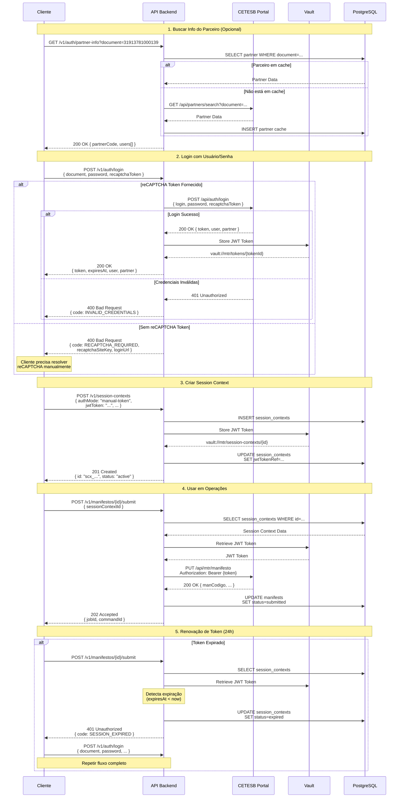
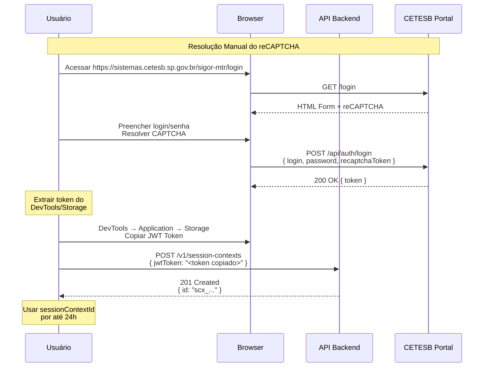
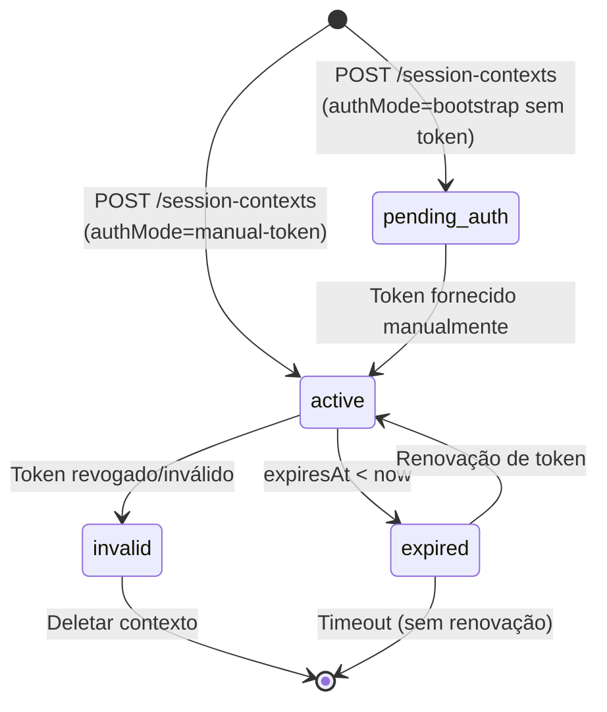

# Diagrama de Sequência: Autenticação Completa

## Fluxo Alternativo: Sem Automação de reCAPTCHA

## Estados de Session Context

## Códigos de Erro

| Código | HTTP | Descrição | Ação |
|--------|------|-----------|------|
| `RECAPTCHA_REQUIRED` | 400 | reCAPTCHA não resolvido | Resolver CAPTCHA e reenviar |
| `INVALID_CREDENTIALS` | 400 | Usuário/senha incorretos | Verificar credenciais |
| `PARTNER_NOT_FOUND` | 404 | CNPJ/CPF não cadastrado | Verificar documento ou cadastrar |
| `SESSION_EXPIRED` | 401 | Token expirado | Refazer login |
| `SESSION_INVALID` | 401 | Token revogado/corrompido | Criar nova sessão |

## Tempo de Vida dos Recursos

| Recurso | TTL | Renovação |
|---------|-----|-----------|
| JWT Token | 24h | Não (refazer login) |
| Session Context | 24h | Atualizar com novo token |
| Partner Info Cache | 7 dias | Automática em background |
| Manifest Draft | Ilimitado | N/A |
